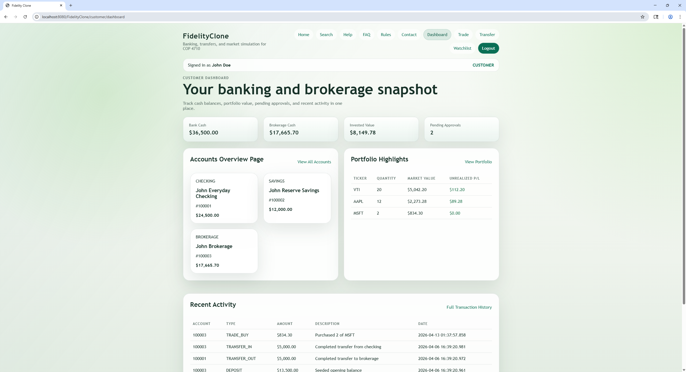

# Parker Shamblin

Computer Science student at the University of South Florida focused on Java backend development, SQL database design, Python, OpenCV, GitHub projects, and clear technical documentation.

- Portfolio: [parkershamblin.com](https://parkershamblin.com/)
- Software engineering overview: [Parker Shamblin Software Engineer Portfolio](https://parkershamblin.com/blog/parker-shamblin-software-engineer)
- LinkedIn: [linkedin.com/in/parkershamblin](https://www.linkedin.com/in/parkershamblin/)

## Featured Portfolio Pages

- [Parker Shamblin Java Backend Project](https://parkershamblin.com/blog/parker-shamblin-java-backend-project)
- [Parker Shamblin OpenCV Project](https://parkershamblin.com/blog/parker-shamblin-opencv-computer-vision-project)
- [Software Engineering Portfolio Overview](https://parkershamblin.com/blog/parker-shamblin-software-engineer)

## Featured Projects

### Retail Banking and Brokerage Platform

Java web application learning project using JSP, Jakarta Servlets, JDBC, Oracle 21c XE, and Apache Tomcat. The project documents public, customer, teller, and manager workflow areas, plus SQL scripts, stored procedures, views, screenshots, and feature-to-database notes.

- Repository: [retail-banking-brokerage-platform](https://github.com/parkershamblin/retail-banking-brokerage-platform)
- Case study: [Java Backend Project](https://parkershamblin.com/blog/parker-shamblin-java-backend-project)

### OpenCV Computer Vision Workflow

Python and OpenCV learning project built around Windows desktop-window capture, cascade-classifier detection, visible rectangle review, and documented constraints. I keep this project framed as a computer vision experiment with limitations and a measurement backlog.

- Repository: [opencv-OSRS1](https://github.com/parkershamblin/opencv-OSRS1)
- Case study: [OpenCV Computer Vision Project](https://parkershamblin.com/blog/parker-shamblin-opencv-computer-vision-project)
- Work page: [OSRS Computer Vision Project](https://parkershamblin.com/work/OSRS-computer-vision-project)

## Current Focus

- Structuring Java web applications with clear request handling and data access layers.
- Documenting SQL-backed application workflows with tables, views, stored procedures, and screenshots.
- Improving Python and OpenCV projects through clearer setup notes, constraints, and measurement plans.
- Writing portfolio content that explains engineering decisions, tradeoffs, current limitations, and next steps.
