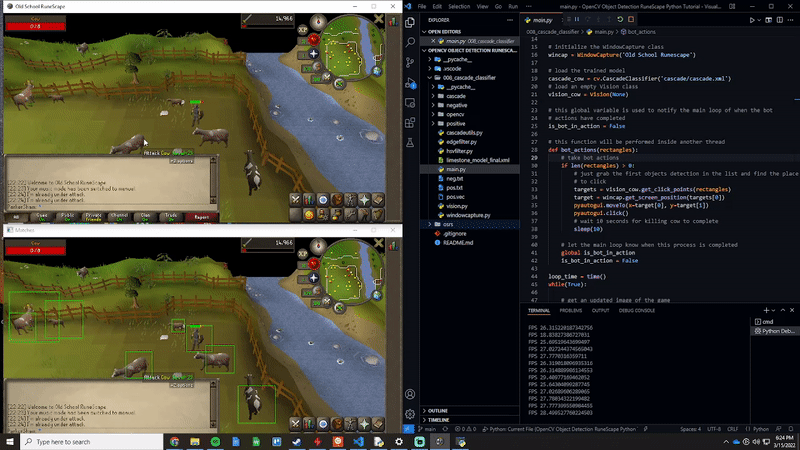

# Hi, I’m Parker Shamblin 👋

🎓 Computer Science student at the University of South Florida  
💻 Building scalable backend services, database systems, and developer tools  
🛠️ Interested in performance, reliability, computer vision, and clean architecture  
📍 Based in Tampa, FL  

---

## Selection of Featured Projects

### [RuneScape Computer Vision Project](https://github.com/parkershamblin/opencv-OSRS1)

Computer Vision Project by Parker Shamblin which automates object detection and gathering in the game Old School RuneScape.

---

### [Full-Stack Java Banking Application](https://github.com/parkershamblin/retail-banking-brokerage-platform)

Full-stack Java web application by Parker Shamblin using Oracle, JSP/Servlets, JDBC, Tomcat, role-based access control, and approval-driven transaction processing.
