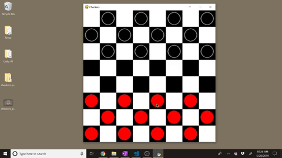

# Hi, I’m Parker Shamblin 👋

🎓 Computer Science student at the University of South Florida  
💻 Building scalable backend services, database systems, and developer tools  
🛠️ Interested in performance, reliability, computer vision, and clean architecture  
📍 Based in Tampa, FL  

---

## Selection of Featured Projects

### [Python OpenCV Computer Vision Project](https://github.com/parkershamblin/opencv-OSRS1)

Computer vision project by Parker Shamblin using Python and OpenCV for object detection, image processing, visual recognition, and experimental automation workflows.

---

### [Full-Stack Java Banking Application](https://github.com/parkershamblin/retail-banking-brokerage-platform)

Full-stack Java web application by Parker Shamblin using Oracle, JSP/Servlets, JDBC, Tomcat, role-based access control, and approval-driven transaction processing.

---

### [Checkers Game with Python/Pygame](https://github.com/parkershamblin/checkers-pygame)

Interactive checkers game built by Parker Shamblin with Python and Pygame, featuring a playable board, move handling, game-state logic, and a graphical user interface.

---

## Links

- [Portfolio](https://parkershamblin.github.io/)
- [LinkedIn](https://www.linkedin.com/in/parkershamblin)
- [GitHub](https://github.com/parkershamblin)
